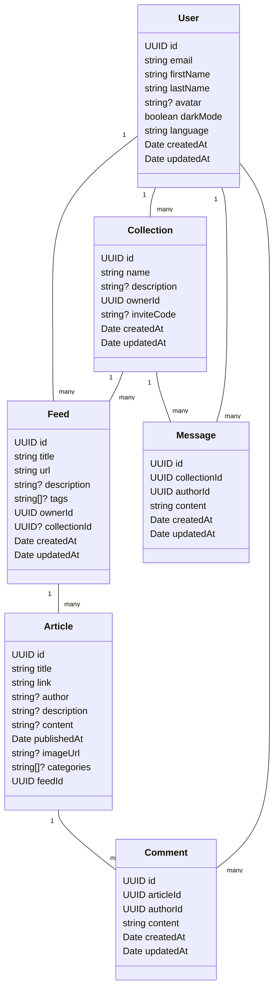

# Documentation technique – SUPRSS

## 1. Présentation du projet

**SUPRSS** est une application de gestion de flux RSS collaborative.  
Elle permet :

- L'ajout, la gestion et le suivi de flux RSS.
- Le marquage d'articles comme lus, favoris, ou leur classement par catégories.
- La création de collections collaboratives de flux.
- Les commentaires et discussions autour des articles.
- L'authentification via e-mail/mot de passe et OAuth (Google, GitHub, Microsoft).

**Architecture globale** :
- **Frontend** : React + Vite (React Query, Zustand, TailwindCSS).
- **Backend** : NestJS + TypeORM + Passport (JWT, OAuth).
- **Base de données** : PostgreSQL.
- **Outils additionnels** : Swagger pour la documentation des API.

---

## 2. Informations nécessaires au fonctionnement

### Dépendances logicielles

- Node.js ≥ 20
- PostgreSQL ≥ 15
- Docker & Docker Compose (optionnel mais recommandé)
- Navigateur moderne (Chrome, Firefox, Edge)

### Variables d'environnement

#### Backend – `backend/.env.example`

```dotenv
# Application
NODE_ENV=development
PORT=3001
FRONTEND_URL=http://localhost:5173

# Base de données
DB_HOST=postgres
DB_PORT=5432
DB_USERNAME=suprss
DB_PASSWORD=suprss
DB_NAME=suprss

# JWT
JWT_SECRET=change-me
JWT_EXPIRES_IN=7d

# OAuth (laisser vide si non utilisé)
GOOGLE_CLIENT_ID=
GOOGLE_CLIENT_SECRET=
GOOGLE_CALLBACK_URL=/auth/google/callback

GITHUB_CLIENT_ID=
GITHUB_CLIENT_SECRET=
GITHUB_CALLBACK_URL=/auth/github/callback

MICROSOFT_CLIENT_ID=
MICROSOFT_CLIENT_SECRET=
MICROSOFT_CALLBACK_URL=/auth/microsoft/callback
```

#### Frontend – `frontend/.env.example`

```dotenv
VITE_API_URL=http://localhost:3001/suprss/api
```

⚠️ **Important** : ne jamais commiter `.env` avec des secrets. Fournir uniquement `.env.example`.

---

## 3. Guide de déploiement

### Option A – Déploiement local sans Docker

Backend :

```bash
cd backend
cp .env.example .env
npm install
npm run build
npm run start:dev
```

Frontend :

```bash
cd frontend
cp .env.example .env
npm install
npm run dev
```

---

### Option B – Déploiement avec Docker Compose

À la racine du projet :

```bash
docker compose up -d --build
```

* Frontend : [http://localhost:5173](http://localhost:5173)
* Backend API : [http://localhost:3001/suprss/api](http://localhost:3001/suprss/api)
* Swagger : [http://localhost:3001/api/docs](http://localhost:3001/api/docs)

---

## 4. Choix technologiques et justification

* **NestJS** : framework modulaire et maintenable, adapté aux API complexes.
* **TypeORM + PostgreSQL** : ORM robuste et performant.
* **Passport (JWT + OAuth)** : gestion standardisée de l'authentification.
* **React + Vite** : rapidité de développement et tooling moderne.
* **React Query** : gestion performante du cache asynchrone.
* **Docker** : déploiement reproductible et simplifié.

---

## 5. Diagrammes UML & base de données

### 5.1 UML (simplifié)



### 5.2 Schéma de la base de données (ERD avec relations distinctives)

```mermaid
erDiagram
  USERS {
    UUID id PK
    string email UK
    string firstName
    string lastName
    string avatar
    boolean darkMode
    string language
    timestamp createdAt
    timestamp updatedAt
  }
  
  COLLECTIONS {
    UUID id PK
    string name
    string description
    UUID ownerId FK
    string inviteCode UK
    timestamp createdAt
    timestamp updatedAt
  }
  
  FEEDS {
    UUID id PK
    string title
    string url UK
    string description
    string[] tags
    UUID ownerId FK
    UUID collectionId FK
    timestamp createdAt
    timestamp updatedAt
  }
  
  ARTICLES {
    UUID id PK
    string title
    string link UK
    string author
    string description
    text content
    timestamp publishedAt
    string imageUrl
    string[] categories
    UUID feedId FK
    timestamp createdAt
    timestamp updatedAt
  }
  
  COMMENTS {
    UUID id PK
    UUID articleId FK
    UUID authorId FK
    text content
    timestamp createdAt
    timestamp updatedAt
  }
  
  MESSAGES {
    UUID id PK
    UUID collectionId FK
    UUID authorId FK
    text content
    timestamp createdAt
    timestamp updatedAt
  }

  USERS |{--o{ FEEDS : "possède (ownerId)"
  USERS ||--}{ COLLECTIONS : "crée (ownerId)"
  COLLECTIONS }|--|{ FEEDS : "contient (collectionId)"
  COLLECTIONS ||..}{ MESSAGES : "organise"
  FEEDS |{--o{ ARTICLES : "publie (feedId)"
  ARTICLES }o--|| COMMENTS : "reçoit (articleId)"
  USERS ||..o{ COMMENTS : "écrit (authorId)"
  USERS }|--|| MESSAGES : "rédige (authorId)"
```

**Légende des relations :**
- `|{--o{` : Relation de possession (ownership) - 1:N
- `||--}{` : Relation de création - 1:N
- `}|--|{` : Relation d'appartenance - N:1 (optionnel)
- `||..}{` : Relation d'organisation avec pointillés - 1:N
- `}o--||` : Relation de réception - N:1

---

## 6. Documentation API (Swagger)

Le backend expose une documentation **Swagger** accessible en mode développement :

👉 **[http://localhost:3001/api/docs](http://localhost:3001/api/docs)**

Elle regroupe :

* **Authentification** : login, register, OAuth callbacks (Google, GitHub, Microsoft)
* **Gestion des utilisateurs** : profil, préférences, avatar
* **Gestion des flux RSS** : ajout, modification, suppression, synchronisation
* **Gestion des articles** : lecture, favoris, marquer comme lu, filtres par catégorie
* **Collections & permissions** : création, partage via code d'invitation, gestion collaborative
* **Messages & commentaires** : discussions autour des articles et dans les collections

### Authentification API

Toutes les routes protégées nécessitent un header Authorization :

```bash
Authorization: Bearer <jwt-token>
```

### Exemples d'endpoints principaux

```typescript
// Authentification
POST /auth/login
POST /auth/register
GET  /auth/google
GET  /auth/github
GET  /auth/microsoft

// Utilisateurs
GET    /users/profile
PUT    /users/profile
POST   /users/avatar

// Flux RSS
GET    /feeds
POST   /feeds
PUT    /feeds/:id
DELETE /feeds/:id
POST   /feeds/:id/sync

// Articles
GET    /articles
GET    /articles/:id
PUT    /articles/:id/read
PUT    /articles/:id/favorite
GET    /articles/search?q=...

// Collections
GET    /collections
POST   /collections
PUT    /collections/:id
POST   /collections/:id/join
GET    /collections/:id/members

// Commentaires
GET    /comments/article/:articleId
POST   /comments
PUT    /comments/:id
DELETE /comments/:id
```

Chaque route inclut les schémas DTO, exemples de requêtes/réponses, et codes d'erreur détaillés.

---

## 7. Architecture et structure du code

### Backend (NestJS)

```
backend/
├── src/
│   ├── auth/           # Authentification (JWT, OAuth)
│   ├── users/          # Gestion des utilisateurs
│   ├── feeds/          # Gestion des flux RSS
│   ├── articles/       # Gestion des articles
│   ├── collections/    # Collections collaboratives
│   ├── comments/       # Système de commentaires
│   ├── messages/       # Messages dans les collections
│   ├── common/         # Utilitaires partagés (guards, decorators, filters)
│   ├── database/       # Configuration TypeORM
│   └── main.ts         # Point d'entrée de l'application
├── test/              # Tests e2e
└── package.json
```

### Frontend (React)

```
frontend/
├── src/
│   ├── components/     # Composants React réutilisables
│   ├── pages/          # Pages de l'application
│   ├── hooks/          # Custom hooks (React Query)
│   ├── stores/         # État global (Zustand)
│   ├── services/       # Appels API
│   ├── types/          # Types TypeScript
│   ├── utils/          # Utilitaires
│   └── App.tsx         # Composant racine
├── public/            # Assets statiques
└── package.json
```

---

## 8. Gestion de la base de données

### Configuration TypeORM

Le projet utilise TypeORM avec `synchronize: true` en développement pour créer automatiquement les tables.

```typescript
TypeOrmModule.forRoot({
  type: 'postgres',
  host: process.env.DB_HOST,
  port: +process.env.DB_PORT,
  username: process.env.DB_USERNAME,
  password: process.env.DB_PASSWORD,
  database: process.env.DB_NAME,
  entities: [User, Collection, Feed, Article, Comment, Message],
  synchronize: process.env.NODE_ENV === 'development', // true en dev
  logging: process.env.NODE_ENV === 'development',
})
```

### Exemple d'entité TypeORM

Chaque entité utilise des décorateurs TypeORM pour définir la structure  par exemple:

```typescript
@Entity('users')
export class User {
  @PrimaryGeneratedColumn('uuid')
  id: string;

  @Column({ unique: true })
  email: string;

  @Column()
  firstName: string;
  
  @OneToMany(() => Feed, feed => feed.owner)
  feeds: Feed[];

  @OneToMany(() => Collection, collection => collection.owner)
  collections: Collection[];
}
```

---

## 9. Sécurité et bonnes pratiques

### Authentification et autorisation

* **JWT** : tokens signés avec expiration (7 jours par défaut)
* **OAuth** : intégration Google, GitHub, Microsoft via Passport
* **Guards** : protection des routes sensibles
* **Validation** : DTO avec class-validator pour toutes les entrées

### Sécurité applicative

* **Helmet** : headers de sécurité HTTP
* **CORS** : configuration restrictive pour le frontend
* **Rate limiting** : protection contre les attaques par déni de service
* **Validation stricte** : sanitisation de toutes les entrées utilisateur
* **Hachage des mots de passe** : bcrypt avec salt

### Gestion des secrets

* Variables d'environnement pour tous les secrets
* Fichiers `.env` jamais versionnés
* Validation au démarrage des variables requises
* Rotation régulière des clés JWT en production

### Outils de qualité

* **ESLint** : analyse statique du code
* **Prettier** : formatage automatique
* **Husky** : hooks Git pour les tests pré-commit
* **TypeScript strict** : typage strict activé
* **SonarJS** : détection des code smells

### Standards de développement

* Convention de nommage cohérente (camelCase, PascalCase)
* Documentation JSDoc pour les fonctions complexes
* Tests obligatoires pour les nouvelles fonctionnalités
* Code reviews systématiques avant merge
* Commits conventionnels (feat, fix, docs, etc.)

---

## 11. Performance et optimisations

### Backend

* **Cache Redis** : mise en cache des flux RSS fréquemment consultés
* **Pagination** : limitation des résultats pour les listes d'articles
* **Indexation database** : index sur les colonnes fréquemment requêtées
* **Compression gzip** : réduction de la taille des réponses HTTP

### Frontend

* **React Query** : cache intelligent des requêtes API
* **Code splitting** : chargement différé des routes
* **Lazy loading** : composants chargés à la demande
* **Memoization** : optimisation du rendu avec useMemo/useCallback
* **Bundle analysis** : analyse de la taille des bundles JavaScript

---

## 12. Déploiement et DevOps

### Environnements

* **Développement** : Docker Compose local
* **Staging** : environnement de test identique à la production
* **Production** : orchestration Docker avec reverse proxy

### CI/CD

```yaml
# Pipeline GitHub Actions (exemple)
name: CI/CD
on: [push, pull_request]
jobs:
  test:
    runs-on: ubuntu-latest
    steps:
      - uses: actions/checkout@v3
      - uses: actions/setup-node@v3
      - run: npm ci
      - run: npm run test
      - run: npm run build
```

